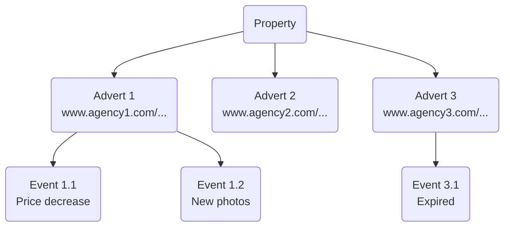

| Concept      | Definition |
| -----------------| -------- |
| Property       | Refers to a specific real estate unit such as a house, apartment, or commercial space. Each property can have multiple adverts, which are different listings referring to the same unit.    |
| Advert       | Unique listing associated with a property. It's a specific presentation or promotion of a property in the real estate market by an agency or an individual.|
| Event       | An event is a specific occurrence or action within the system, such as the creation, update, or expiration of adverts, which can be tracked and responded to via the API.    |
| Match       | A match refers to a result that fulfills a user's saved search criteria, representing a new property that meets the specific conditions defined by the user in their search.    |
| Search   | A search is a user-defined entity that is saved and that allows for the real time retrieval of properties or adverts based on specific criteria, such as location, price range, or property type.      |
| Webhook   | A webhook is a tool that allows the API to send real-time data to a specified endpoint, such as notifying a user or system when a new advert matches a saved search criteria, or when an event occurs on a monitored search.       |
| lastCrawledAt | At property level, this field represents the date of the last update of the most recent advert, excluding expired ones. At the advert level, expired adverts are included.